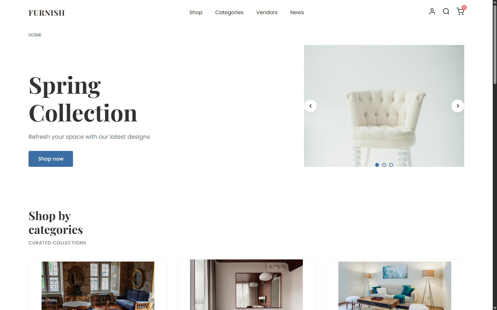

# Furnish 🪑

A modern furniture website built with HTML and CSS, showcasing elegant furniture designs and collections.

## 🖼️ Preview

### 🖥️ Desktop View

*Modern and elegant furniture showcase homepage*

## 📋 Table of Contents

- [About](#-about)
- [Features](#-features)
- [Preview](#️-preview)
- [Project Structure](#-project-structure)
- [Getting Started](#-getting-started)
- [Usage](#-usage)
- [Technologies Used](#️-technologies-used)
- [License](#-license)

## 🏠 About

Furnish is a responsive furniture showcase website designed to display furniture collections in an elegant and user-friendly interface. The project demonstrates modern web design principles using pure HTML and CSS, featuring smooth animations, responsive layouts, and an intuitive user experience.

## ✨ Features

- 📱 **Fully Responsive** - Works seamlessly on desktop, tablet, and mobile
- 🎨 **Modern Design** - Clean, elegant interface with smooth animations
- 🖼️ **Image Gallery** - Comprehensive showcase of furniture collections
- 🎯 **Smooth Navigation** - Intuitive user experience with easy browsing
- ⚡ **Fast Loading** - Optimized performance with pure HTML/CSS
- 🎨 **Custom Styling** - Unique design elements and hover effects

## 📁 Project Structure

```
Furnish/
├── css/                   # Stylesheets directory
│   └── style.css     
├── html/                  # Additional HTML pages      
│   └── zoom_entry.html    
├── media/                 # Media assets directory
├── screenshots/           # README screenshots
├── index.html             # Main homepage
├── LICENSE                # MIT License
└── README.md              # Project documentation
```

## 🚀 Getting Started

### Prerequisites

- A modern web browser (Chrome, Firefox, Safari, Edge)
- A code editor (VS Code, Sublime Text, etc.) - optional for modifications

### Installation

1. Clone the repository:
   ```bash
   git clone https://github.com/wale-eddine/Furnish.git
   ```

2. Navigate to the project directory:
   ```bash
   cd Furnish
   ```

3. Open `index.html` in your web browser:
   - Double-click the `index.html` file, or
   - Right-click and select "Open with" your preferred browser, or
   - Use a local server (recommended for development)

### Using a Local Server

For the best development experience, use a local server:

```bash
# Using Python 3
python -m http.server 8000

# Using Node.js (if you have live-server installed)
npx live-server

# Using PHP
php -S localhost:8000
```

Then open `http://localhost:8000` in your browser.

## 💻 Usage

1. **Homepage**: Start at `index.html` to view the main furniture showcase
2. **Navigation**: Use the navigation menu to browse different sections
3. **Responsive Design**: Resize your browser window to see the responsive layout in action
4. **Media Gallery**: Browse through the furniture images in the media section

## 🛠️ Technologies Used

- **HTML5** (67.2%) - Structure and content
- **CSS3** (32.8%) - Styling and layout
- **Responsive Design** - Mobile-first approach
- **Modern CSS Features** - Flexbox, Grid, animations

## 🎨 Customization

To customize the website:

### Colors and Themes
```css
/* Modify CSS variables in your main stylesheet */
:root {
  --primary-color: #your-color;
  --secondary-color: #your-color;
  --accent-color: #your-color;
}
```

### Adding New Furniture Items
1. Add images to `media/images/`
2. Update HTML structure in relevant pages
3. Adjust CSS grid layouts if needed

### Responsive Breakpoints
```css
/* Mobile */
@media (max-width: 768px) { }

/* Tablet */
@media (min-width: 769px) and (max-width: 1024px) { }

/* Desktop */
@media (min-width: 1025px) { }
```

## 📱 Browser Support

- ✅ **Chrome** (latest)
- ✅ **Firefox** (latest)
- ✅ **Safari** (latest)
- ✅ **Edge** (latest)
- ✅ **Mobile browsers** (iOS Safari, Chrome Mobile)


### Development Guidelines

- 📝 Follow semantic HTML5 structure
- 🎨 Use consistent CSS naming conventions (BEM methodology preferred)
- 📱 Ensure responsive design across all devices
- 🧪 Test across different browsers and screen sizes
- ⚡ Optimize images and assets for web performance
- 📚 Document any new features or changes

## 📄 License

This project is licensed under the MIT License - see the [LICENSE](LICENSE) file for details.

## 👤 Author

**wale-eddine**
- GitHub: [@wale-eddine](https://github.com/wale-eddine)

---

⭐ **If you found this project helpful, please give it a star on GitHub!**

## 📞 Support

If you have any questions or need help with understanding this small project, please:
- Contact the maintainer

---

*Built with ❤️ by Wale Eddine*

*Last updated: 22 July 2025*
